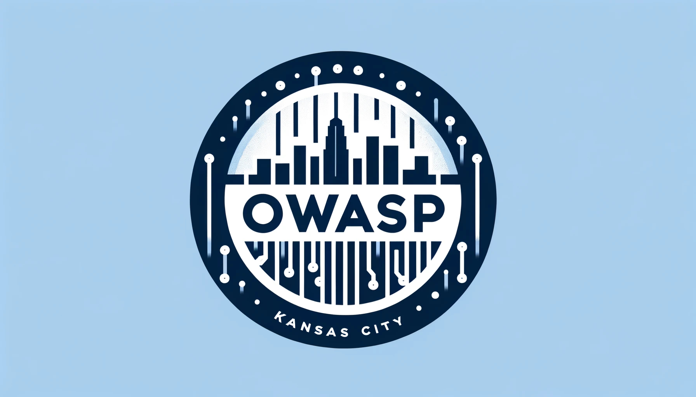

---

layout: col-sidebar
title: OWASP Kansas City
tags: web-application-security kansas-city missouri
level: 0

region: North America
meetup-group: OWASP-Kansas-City
country: USA
---
## Welcome

Welcome to the OWASP [KC](https://en.wikipedia.org/wiki/Kansas_City_metropolitan_area) Chapter Homepage!

We meet monthly and are starting at a new location at the Keystone Innovation District in the Crossroads.

## Our Chapter
OWASP-KC’s mission is to be a welcoming community for Developers, Security Champions, and Information Security Professionals to learn, communicate, and share their perspectives at a common table.

## Upcoming Events
### OWASP Kansas City Chapter Meeting
**When:** Thursday, April 18th, 2024 @5:30pm - 8:00pm  
**Where:** Keystone Innovation CoLab (800 E 18th St, KCMO 64108)  
**Speaker:**  Joshua Williams  
**Presentation:** A Review on New, Exciting OWASP Projects Everyone Should Know

**RSVP:** https://www.meetup.com/OWASP-Kansas-City/

---
## Supporters
We are open and happy to host sponsors for our meetups. Please contact [Josh](mailto:j.williams@owasp.org) or [Joe](mailto:joe.nicastro@owasp.org) about sponsoring a meeting.

---
## Participation

The Open Web Application Security Project (OWASP) is a nonprofit foundation that works to improve the security of 
software. All of our projects, tools, documents, forums, and chapters are free and open to anyone interested in 
improving application security. 

Chapters are led by local leaders in accordance with the [Chapter Policy](https://owasp.org/www-policy/). Financial contributions should only be made online using the authorized online donation button. To be a SPEAKER at ANY OWASP Chapter in the world simply just review the [speaker agreement](/www-policy/speaker-agreement) and then contact the local chapter leader with details of what OWASP Project, independent research, or related software security topic you would like to present.

Everyone is welcome and encouraged to participate in our [Projects](/projects), [Local Chapters](/chapters), [Events](/events), [Online Groups](https://groups.google.com/a/owasp.com/){:target='_blank'}, and [Community Slack Channel](https://owasp.slack.com/){:target='_blank'}. We especially encourage diversity in all our initiatives. OWASP is a fantastic place to learn about application security, to network, and even to build your reputation as an expert. We also encourage you to be [become a member](/membership) or consider a [donation](/donate) to support our ongoing work.
